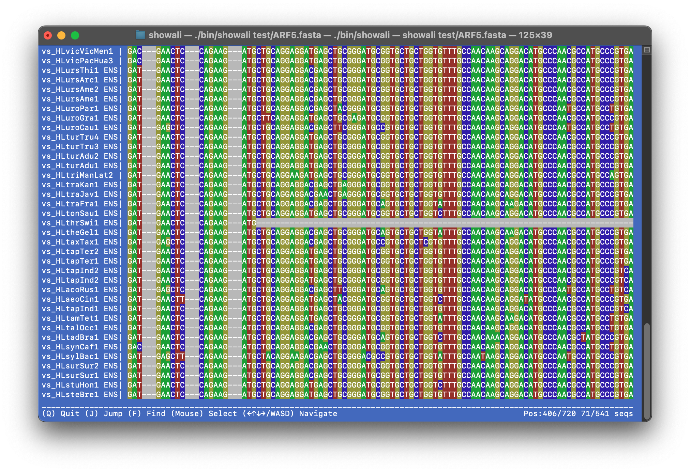

# Showali – TUI alignment viewer


Sometimes you just want to run `showali my_alignment.fasta` and see your sequences.

## Purpose & Disclaimer

I made `showali` out of pure personal need: a minimalist way to quickly glance at multiple sequence alignments right in my terminal.  
This is _not_ a full-featured MSA suite. It does exactly what I needed and nothing more.

No GUI, no file wrangling. Just open & go.
If you share that pain, here’s a tool for you.

Contributions and patches are welcome, but please respect the minimalist spirit:  
if you really need heavyweight features, there are plenty of other tools out there.  


*v0.9.6 screenshot*

## How to install

```bash
git clone git@github.com:kirilenkobm/showali.git
cd showali
make
# add bin/showali to your path, enjoy!
```

## Suppoted formats 

- fasta
- maf (beta)
- phy (beta)
- aln (beta)

## Future Plans for V1

1. `F`command needs some improvement

2. Allow selecting sequence IDs, at least visible parts

## That's pretty much it.
