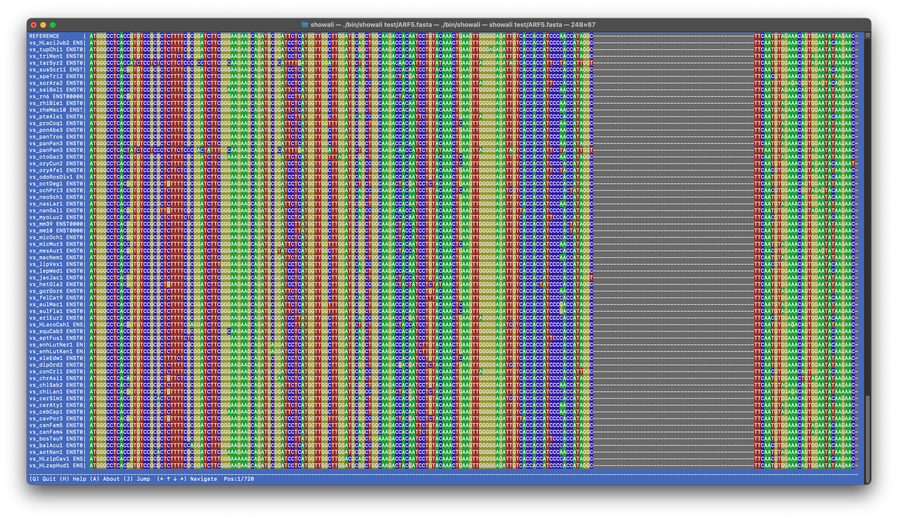

# Showali – TUI alignment viewer


Sometimes you just want to run `showali my_alignment.fasta` and see your sequences.


*v0.1.5 screenshot*

## How to install

```bash
git clone git@github.com:kirilenkobm/showali.git
cd showali
make
# add bin/showali to your path, enjoy!
```

That's pretty much it.
