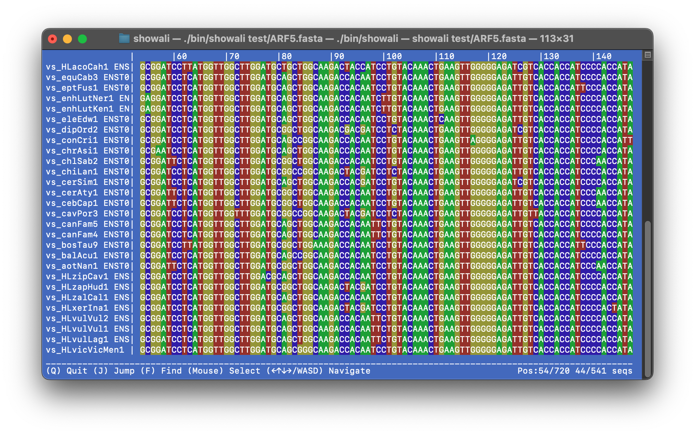

# Showali – TUI alignment viewer


[](https://anaconda.org/bioconda/showali)

Sometimes you just want to run `showali my_alignment.fasta` and see your sequences.

## Purpose & Disclaimer

I made `showali` out of pure personal need: a minimalist way to quickly glance at multiple sequence alignments right in my terminal.  

This is _not_ a full-featured MSA suite. It does exactly what I needed and nothing more.
No GUI, no file wrangling. Just open & go.

Contributions and patches are welcome, but please respect the minimalist spirit:  
if you really need heavyweight features, there are plenty of other tools out there.  


*v1.0.0 screenshot*

## How to install

Option 1: via Bioconda

```bash
conda install -c bioconda showali
```

Option 2: build from source

```bash
git clone git@github.com:kirilenkobm/showali.git
cd showali
make
./bin/showali test/test.fa
# add bin/showali to your path, enjoy!
```

**Supported formats (auto-detected):** FASTA, MAF, PHYLIP (​.phy​), CLUSTAL/ALN (​.aln​).

## That's pretty much it.
